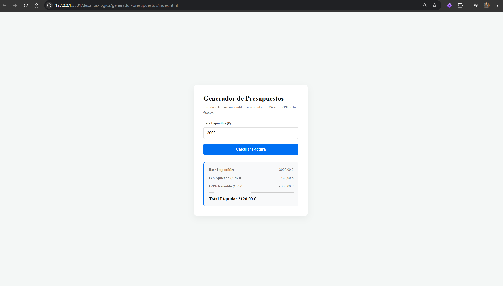

# 📄 Generador de Presupuesto para Autónomos - Invoice Engine 

Este proyecto es una hierramienta comercial interactiva diseñada para la gestión de facturación de trabajadores autónomos en España. Permite calcular de forma instantánea el impacto fiscal de una factura a partir de la Base Imponible, aplicando correctamente las normativas de retención locales.

## 📸 Vista Previa del proyecto

Interfaz de usuario moderna con inyección dinámica de datos en el DOM: 

## 🚀 Tecnologías Utilizadas

- **HTML5:** Formularios nativos con control de tipos ('<input type="number">').
- **CSS3 Moderno:** Diseño de interfaz flotante mediante Flexbox, pseudo-clases de interacción ('input:focus', 'button:hover'), y técnicas avanzadas de distribución de contenidos ('justify-content: space-between').
- **JavaScript (ES6+):** Manipulación estricta del DOM mediante 'document.getElementByld()', manejo y validación de cadenas de texto y uso de cadenas de plantillas nativas para la inyección dinámica de componentes HTML.

## 💡 Soluciones de Ingenierías y Reglas de Negocio 

- **Cumplimiento de la Ley Fiscal Española:** A diferencia de cálculos acumulativos erróneos, el sistema calcula de forma independiente tanto el IVA (21%) como la retención del IRPF (15%) basándose estrictamente en la Base Imponible original, garantizando la precisión legal del Total Líquido.
- **Transición de Prompt a UI Dinámica:** El proyecto marca la evolución de scripts de consola hacia aplicaciones web reales mediante la propiedad `.innerHTML`, mejorando drásticamente la experiencia del usuario (UX).
- **Internacionalización Comercial:** Integración nativa de la Web API `Intl.NumberFormat` para el formateo estandarizado de moneda en la eurozona (`es-ES`, `EUR`).