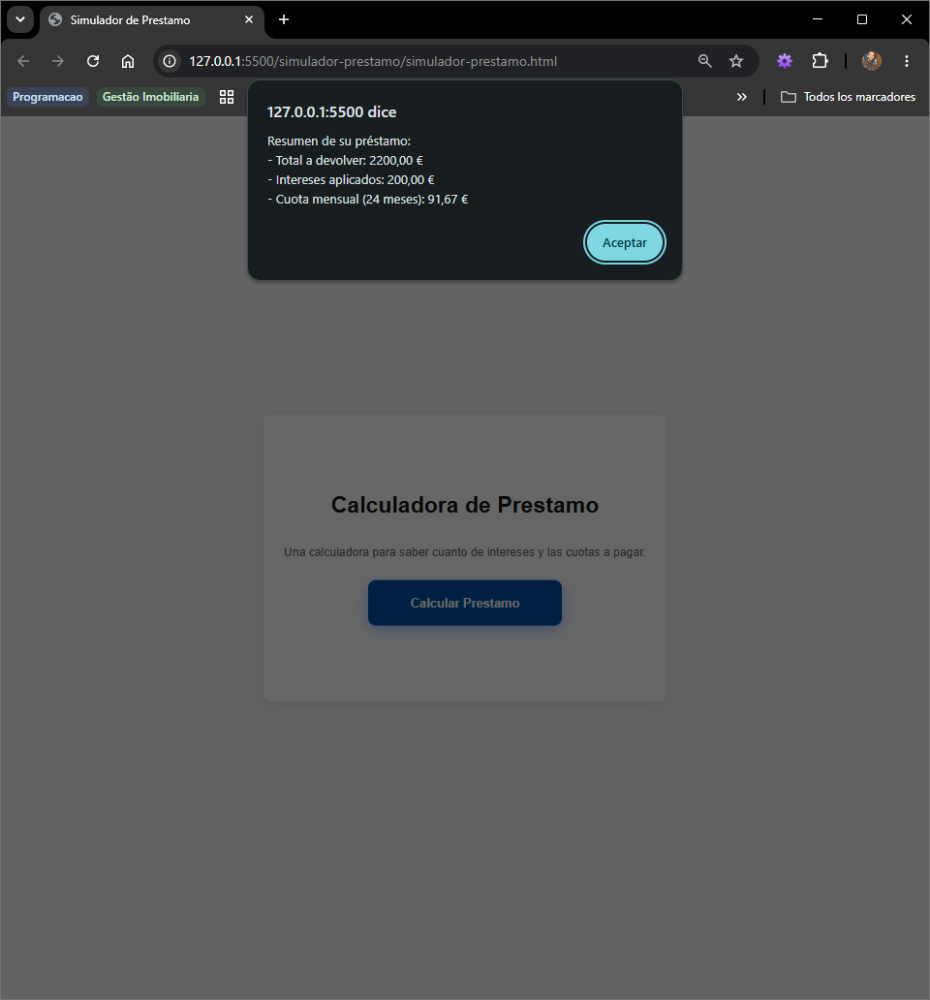

markdoen

# 🏦 Simulador de Préstamo Bancario - Fintech Local

Este projecto es un simulador financeiro interactivo dessarrollado en JavaScript nativo. Está diseñado para resolver un problema de negocio real: permitir que un cliente bancario calcule de forma transparente el coste total, los intereses aplicados y el valor de las cuotas mensuales de un préstamo en Euros (€), adaptándose al estándar financiero europeo.

## 📸 Vista Previa del proyecto

Aquí puedes ver el sistema funcionando en tiempo real con la conversíon nativa de moneda:

## 🚀 Tecnologías Utilizadas

- **HTML5:** Estructuracíon semática del contenedor de la calculadora.
- **CSS3 Moderno:** Diseño de tarjeta centralizada de forma absoluta utilizando flexbox ('min-height: 100vh'), sombras suaves ('box-shadow') y efecto de interaccíon dinámica (':hover' con transformaciones).
- **JavaScript Moderno (ES6+):** Lógica condicional estricta, operadores lógicos y funciones nativas.

## 💡 Características y soluciones de Ingeniería 

- **Internacionalizacíon Oficial ('Intl.NumberFormat'):** En lugar de usar formateadores de texto simples, el sistema utiliza la API oficial de JavaScript configurada para el estándar de España (`es-ES` y `EUR`), separando correctamente los millares con puntos y los decimales con comas.
- **Control de Errores Preventivo:** Uso del operador lógico `||` (O) para validar las entradas del usuario de forma flexible (aceptando opciones abreviadas como "1" o completas como "12" meses), evitando fallos en la experiencia del usuario (UX).
- **Control de Flujo con `return;`:** Mecanismo de seguridad para detener la ejecución del script si se detectan datos de entrada no válidos, evitando la aparición de errores críticos en la interfaz como `NaN`.